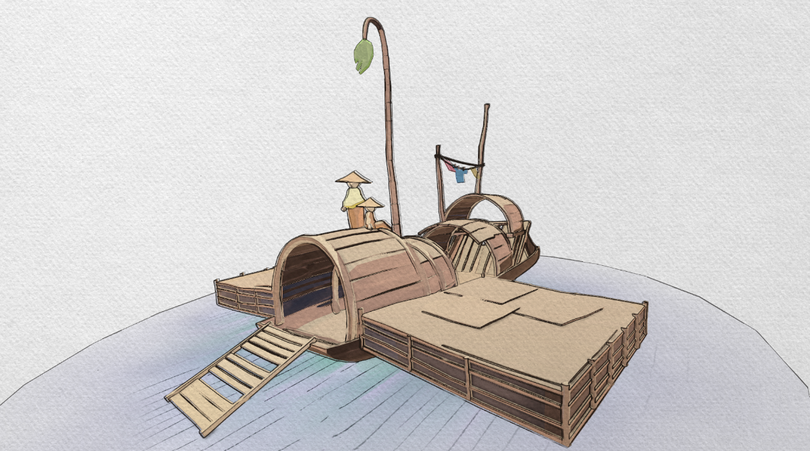
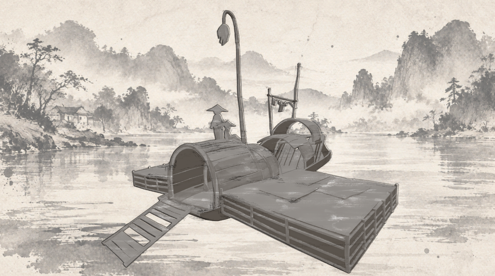
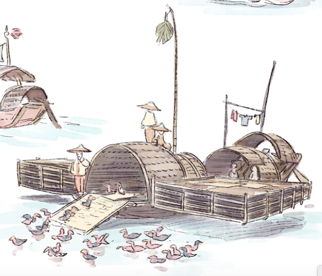

# HW2: 3D Stylization

For this project, I created a stylized floating boat scene inspired by an illustration created by Scott Watanabe, the GOAT (imo). I wanted the final scene to feel soft, hand-painted, and slightly sketchy, so most of my shader and post-processing choices were focused around watercolor textures, uneven outlines, and a light color palette. I tried to make some of the animated outlines look pencil-ed in, rather than pen/CG.

## Final Result

### Turnaround
(Please see repo! Too big to put here)

---

## Concept Art

I chose this concept because I liked its soft watercolor colors and hand-drawn feeling. Some of the main things I wanted to recreate were the light color palette, slight watercolor textured shadows, and sketchy outlines.

Concept artist: Scott Watanabe (he has a LOT of really good work for this specific assignment)

---

## Surface Shader

I started with the three-tone toon shader from the stylization lab and expanded it for my scene.

My main surface shader includes:

- Three-tone toon shading
- Support for multiple lights
- Rim lighting
- Custom textured shadows
- Object UV-based shadow texture mapping
- Adjustable shadow texture scale
- Colors that can be changed per material

I created a seamless watercolor texture for the shadows. Instead of sampling the shadow texture using screen position, I used the object's UVs so that the texture stays attached to the object.

---

## Special Surface Shader

For my special shader, I chose to use vertex animation.

I created separate animated shaders for the hanging cloth and leaf in the scene. The vertex positions are moved over time to create a simple swaying motion.

For the cloth, I used its position to control which parts of the mesh move more, so the attached area stays more stable while the rest of the cloth moves.

I used a similar setup for the hanging leaf.

---

## Water Shader

I also created a separate stylized shader for the water.

The water uses a light blue watercolor look with animated noise and hand-drawn water line textures. I wanted it to match the painted style of the rest of the scene instead of looking like realistic water.

---

## Outlines

I created post-process outlines using the scene's depth and normal information.

The outline system includes:

- Depth-based outlines
- Normal-based outlines
- Thicker normal edges
- Adjustable outline thickness
- Noise and texture to make the lines feel less perfect and more hand-drawn

I used Sobel edge detection to find changes in the depth and normal buffers. I then combined the different outline masks to get both the outside silhouette and smaller details inside the model. In addition, I also implemented a "Thicker Lines" version of Sobel, which helped get the thicker-pencil look.

---

## Full Screen Post Process

For my main post-process effect, I added a paper texture over the rendered scene.

The strength and contrast of the paper texture can be adjusted. This helped make the final render feel more like an illustration on paper instead of a normal 3D render.

---

## Scene

For the final scene, I created a floating boat/house environment based on my concept.

I used the shaders throughout the scene with different colors and settings for the wood, clothing, hats, and other objects. I also added lighting and the stylized water around the boat.

---

## Interactivity: Ink Wash Mode

Press **Space** to switch between the normal watercolor mode and an alternate Chinese ink wash mode.

For this mode, I created a second full-screen post-process material. The ink mode changes the scene into a mostly monochrome ink-style render with darker outlines, paper-like values, more wash-y-ness, and a traditional Chinese landscape background.

When Ink Wash Mode is activated:

- The normal full-screen material is swapped for the Ink Wash material
- The scene becomes mostly grayscale with dark ink-like values
- The outline style becomes heavier and more ink-like
- A Chinese ink landscape is used as the background
- The normal water mesh is hidden so the scene blends better with the painted background

Pressing **Space** again switches everything back to the normal watercolor mode.

